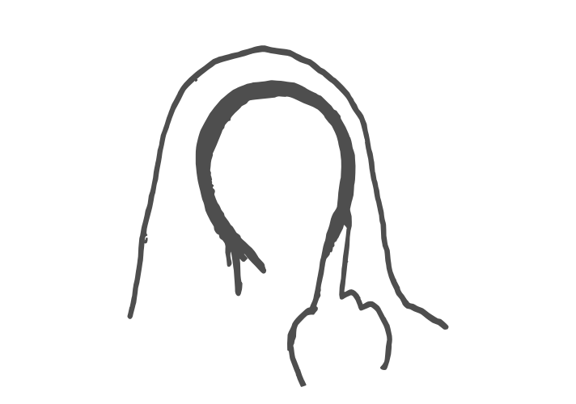

# portrait

<p align="center">
    
</p>

<p align="center">
  Observation metrics for periodic events
  <br>
  <p align="center">
    <a href="https://github.com/lgrcia/portrait">
      </a>
    <a href="">
      </a>
    <a href="https://portrait.readthedocs.io">
      </a>
  </p>
</p>

A Python package to compute and visualize observation metrics for periodic events.

In Astronomy, *portrait* is useful to answer the following questions:
- How much of an orbit with period $P$ has been observed given certain observation times? ([tutorial](https://portrait.readthedocs.io/en/latest/coverage.html))
- What period $P$ matches with this list of events? ([tutorial](https://portrait.readthedocs.io/en/latest/periodmatch.html))
- How a certain target must be observed to cover all orbits with periods lower than $P$ days?

Documentation at [portrait.readthedocs.io](https://portrait.readthedocs.io)

## Example
Given the range of periods you want to cover, here is how to compute the amout of phase covered by your observation times
```python
from portrait import coverage

time = ... # your observation times
periods = np.linspace(0.1, 10, 2000)

covered = coverage(times)(periods) 
```
And plotting it with `matplotlib`
```python
import matplotlib.pyplot as plt

plt.subplot(111, xlabel="periods", ylabel="coverage")
plt.plot(periods, covered, c="0.5")
```


## Installation

```bash
pip install portrait
```
